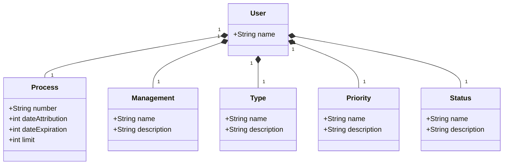

# Avanade Decola Tech 2025
Projeto Java RESTful API - Avanade Decola Tech 2025

## Diagrama de Classes


## JSON
```
{
  "name": "Rafael",
  "process": {
    "number": "00050-00018829/2023-87",
    "dateAttribution": 10052025,
    "dateExpiration": 10052025,
    "limit": 15
  },
  "management": {
      "name": "GEIP",
      "description": "Descrição da Gerência"
    },
  "type": {
      "name": "Aquisição",
      "description": "Descrição do objeto"
    },
  "priority": {
      "name": "Alta",
      "description": "Descrição da Prioridade"
    },
  "status": {
      "name": "Concluído",
      "description": "Descrição do Status"
    }
}
```
## Documentação da API (Swagger)

### [https://web-production-c49d.up.railway.app/swagger-ui.html](https://web-production-c49d.up.railway.app/swagger-ui.html)
